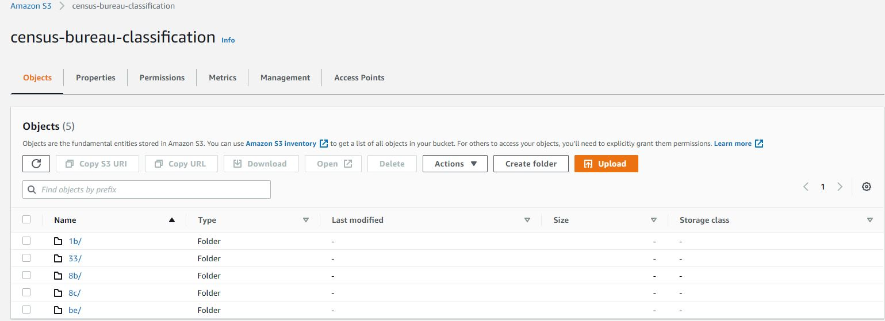

[](https://github.com/ChristopherCochet/census_bureau_classification_heroku_pipeline/actions/workflows/census-app.yml)

# CI/CD ML Pipeline for Census Bureau Salary Classification Using github Actions, DVC, FastAPI and Heroku

**Project description:** In this project, we will be deploying an end to end CI/CD pipeline salary classification web app using scikit-learn, dvc, github actions, FastAPI and Heroku. The pipeline classifies the salaries of citizens based on a census bureau dataset. The focus on the project is on the CI/CD pipeline and MLOps process to quickly test and deploy revisions of the model while modelling takes a back seat.

Source: [Udacity - Machine Learning DevOps Engineer Nano-degree](https://www.udacity.com/course/machine-learning-dev-ops-engineer-nanodegree--nd0821)


The different component of the pipeline are: 
  * [Exploratory Data Analysis & Data cleaning](#1-exploratory-data-analysis-eda-and-cleaning)
  * [Modelling](#2-modelling-and-evaluation)
  * [Model Testing](#3-model-testing)
  * [Data Version Control (DVC)](#4-data-version-control)
  * [API creation with FastAPI](#5-api-creation-with-fastapi)
  * [Testing Fast API Locally](#6-testing-fastapi-locally)
  * [App Set-up On Heroku](#7-app-set-up-on-heroku)
  * [Continuous Deployment with Heroku](#8-continuous-deployment-with-heroku)
  * [Testing the Deployed Heroku App](#9-testing-the-deployed-heroku-app)
---

## MLOps Tools Used for this Project

  * Github Actions for the pipeline's continuous integration and the pipeline's release management
  * DVC for data and model artifact versioning
  * AWS S3 to store the pipeline's artifacts  
  * Scikit-learn for the modelling
  * Pytest for the validation of the cleaned dataset
  * Fast API for the web app creation and predictions serving
  * Heroku for the continuous deployment of the Fast API web app

<kbd>  </kbd>


## Project Links
 * [Project instructions](starter/instructions.md)
 * [Heroku Web App](https://census-bureau-salary-pred.herokuapp.com/)
 * [Github repository](https://github.com/ChristopherCochet/census_bureau_classification_heroku_pipeline)

## Overview of the CI/CD Pipeline's Code Organization

```
├── Aptfile
├── LICENSE.txt
├── Makefile
├── Procfile
├── README.md
├── requirements.txt
├── runtime.txt
└── starter
    ├── data
    │   ├── census.csv
    │   ├── census.csv.dvc
    │   ├── census_clean.csv
    │   └── census_clean.csv.dvc
    ├── main.py
    ├── model
    │   ├── census_feature_encoding.pkl
    │   ├── census_feature_encoding.pkl.dvc
    │   ├── census_model.pkl
    │   ├── census_model.pkl.dvc
    │   ├── feature_importances.csv
    │   ├── feature_importances.csv.dvc
    │   ├── model.txt
    │   ├── model.txt.dvc
    │   ├── slice_output.txt
    │   └── slice_output.txt.dvc
    ├── model_card_template.md
    ├── notebooks
    │   ├── census-eda-clean.ipynb
    │   └── census-modelling.ipynb
    ├── setup.py
    ├── starter
    │   └── ml
    │       ├── data.py
    │       ├── model.py
    │       ├── test_slice.py
    │       └── train_model.py
    ├── templates
    │   ├── base.html
    │   └── home.html
    └── test_main.py
```

## Pipeline Configuration
The parameters controlling the pipeline are defined in two files:

* the Github Action [``census-app.yml``](https://github.com/ChristopherCochet/census_bureau_classification_heroku_pipeline/blob/master/.github/workflows/census-app.yml) file defined in the ``.github/workflows`` project directory.

* the [``Makefile``](https://github.com/ChristopherCochet/census_bureau_classification_heroku_pipeline/blob/master/Makefile) defined in the root of the project which holds the project's scaffolding including build requirements, linting and testing .

```
install:
	pip install --upgrade pip && pip install -r requirements.txt

test:
	pytest -vv

format:
	black starter/*.py starter/starter/ml/*.py

lint:
	flake8 --ignore=E303,E302  --max-line-length=88 starter/*.py starter/starter/ml/*.py

dvc:
	dvc pull -r s3remote
```

## Continuous Integration with Github Actions

With Github action, the continuous integration is triggered every time a push is made to the code using teh following setting in the ``census-app.yml`` file

```
> on: [ push ]
```

**Continuous Integration - Github Action Runs**


**Continuous Integration - Latest Build Status**


# 1. Exploratory Data Analysis (EDA) And Cleaning

<kbd>  </kbd>
The basic EDA and cleaning tasks were performed in the following notebook: [here](https://github.com/ChristopherCochet/census_bureau_classification_heroku_pipeline/blob/master/starter/notebooks/census-eda-clean.ipynb)

Census Income Data Set: https://archive.ics.uci.edu/ml/datasets/census+income

> Dua, D. and Graff, C. (2019). UCI Machine Learning Repository [http://archive.ics.uci.edu/ml]. Irvine, CA: University of California, School of Information and Computer Science.

The raw dataset has 32k rows and the following features (the ``salary`` feature being the label that the model will predict):

* **age**
    * > continuous.
- **workclass**
    * > Private, Self-emp-not-inc, Self-emp-inc, Federal-gov, Local-gov, State-gov, Without-pay, Never-worked.
* **fnlwgt**
    * > continuous.
* **education**
    * > Bachelors, Some-college, 11th, HS-grad, Prof-school, Assoc-acdm, Assoc-voc, 9th, 7th-8th, 12th, Masters, 1st-4th, 10th, Doctorate, 5th-6th, Preschool.
* **education-num**
    * > continuous.
* **marital-status**
    * > Married-civ-spouse, Divorced, Never-married, Separated, Widowed, Married-spouse-absent, Married-AF-spouse.
* **occupation**
    * > Tech-support, Craft-repair, Other-service, Sales, Exec-managerial, Prof-specialty, Handlers-cleaners, Machine-op-inspct, Adm-clerical, Farming-fishing, Transport-moving, Priv-house-serv, Protective-serv, Armed-Forces.
* **relationship**
    * > Wife, Own-child, Husband, Not-in-family, Other-relative, Unmarried.
* **race**
    * > White, Asian-Pac-Islander, Amer-Indian-Eskimo, Other, Black.
* **sex**
    * > Female, Male.
* **capital-gain**
    * > continuous.
* **capital-loss**
    * > continuous.
* **hours-per-week**
    * > continuous.
* **native-country**
    * >  United-States, Cambodia, England, Puerto-Rico, Canada, Germany, Outlying-US(Guam-USVI-etc), India, Japan, Greece, South, China, Cuba, Iran, Honduras, Philippines, Italy, Poland, Jamaica, Vietnam, Mexico, Portugal, Ireland, France, Dominican-Republic, Laos, Ecuador, Taiwan, Haiti, Columbia, Hungary, Guatemala, Nicaragua, Scotland, Thailand, Yugoslavia, El-Salvador, Trinadad&Tobago, Peru, Hong, Holand-Netherlands.
* **salary**
    *  >50K, <=50K

# 2. Modelling and Evaluation

<kbd>  </kbd>
The basic modeling tasks were performed in the following notebook adn then turned into a python script: [link](https://github.com/ChristopherCochet/census_bureau_classification_heroku_pipeline/blob/master/starter/notebooks/census-modelling.ipynb)

The problem at hand is a binary classification (classification of salaries : =>50K or <=50K)  with labels somewhat imbalanced: approximately 25% of labels >50K and 75% <=650K and an ``roc_auc_score`` was used to evaluate a set of different models. The best performing models saved was a tuned ``GradientBoostingClassifier`` using scikit-learn.

**Model's roc-auc-curve**


**Model's feature importances**


**Model training script and best performing model results:**
```bash
> python starter/starter/ml/train_model.py
```

```
Model with highest roc_auc:
GradientBoostingClassifier(loss='exponential', max_depth=5, n_estimators=150)
Fit best performing model...

Compute metrics...
Model metrics: precision = 0.8093745101113027, recall = 0.6876664890783165, fbeta(1) = 0.7435731259451286
```

**Slice test results on the ``education`` feature:**
```
                        precision    recall     fbeta
education_10th           1.000000  0.271186  0.426667
education_11th           1.000000  0.406780  0.578313
education_12th           0.909091  0.344828  0.500000
education_1st-4th        1.000000  0.166667  0.285714
education_5th-6th        0.800000  0.333333  0.470588
education_7th-8th        0.714286  0.142857  0.238095
education_9th            1.000000  0.160000  0.275862
education_Assoc-acdm     0.780591  0.722656  0.750507
education_Assoc-voc      0.786517  0.610465  0.687398
education_Bachelors      0.786864  0.850894  0.817627
education_Doctorate      0.858521  0.953571  0.903553
education_HS-grad        0.846154  0.380952  0.525373
education_Masters        0.842916  0.894336  0.867865
education_Preschool      1.000000  1.000000  1.000000
education_Prof-school    0.902326  0.955665  0.928230
education_Some-college   0.753991  0.601048  0.668888
education-num            1.000000  1.000000  1.000000
```

Refer to the **model's information card** for detailed information [here](https://github.com/ChristopherCochet/census_bureau_classification_heroku_pipeline/blob/master/starter/model_card_template.md)

# 3. Model Testing

After the data set cleaning, a set of test validate the resulting dataset characteristics:
```
test_data_shape
""" Check that data has no null value """

test_data_char_cleaned
""" Check that there are no ? characters in the categorical features """

test_data_column_name_cleaned
""" Check that there are no spaces in the column names """

test_one_generate_feature_encoding
""" Check that the feature encoding column transformer object is created """

test_one_hot_encode_feature_df
""" Check that the data is processed and encoded successfully using
    the column transformer pickle file
"""
test_one_hot_encode_feature_sample
""" Test data preprocessing and encoding """
```

```bash
> pytest starter/starter/ml/test_slice.py -vv
```


# 4. Data Version Control

DVC was used to track the version of the pipeline's key artifacts using an AWS S3 bucket:
* raw data: ``census.csv``
* cleaned data: ``census_clean.csv``
* model & model characteristics: ``census_model.pkl`` ``feature_importances.csv``
* data preprocessing and encoding module: ``census_feature_encoding.pkl``
* model slice test results (precision, recall, beta): ``slice_output.txt``

**To check the artifacts managed by DVC:**
```bash
> dvc dag
```


**To retrieve the latest version of the pipeline's artifacts from the S3 bucket:**
```bash
> dvc pull -r s3remote
```



This requires AWS credentials to be properly set-up - more information [here](https://github.com/marketplace/actions/configure-aws-credentials-action-for-github-actions)
```bash
> AWS_ACCESS_KEY_ID
> AWS_SECRET_ACCESS_KEY 
```

# 5. API creation with FastAPI

The ``main.py`` file holds the code to turn the pipeline into a web api using the Fast API framework with the ``/predict`` route used to manage requests, process data and generate inferences :

```
@census_app.post("/predict")
async def get_prediction(payload: census_data):

    # Convert input data into a dictionary and then pandas dataframe
    census_data_df = pd.DataFrame.from_dict([payload.dict()])
    census_data_df.columns = census_data_df.columns.str.replace("_", "-")

    # load data encoder
    with open(feature_encoding_file, "rb") as file:
        ct = pickle.load(file)

    # process post census data
    encoded_census_df = one_hot_encode_feature_df(census_data_df, ct)

    # load model
    census_model = pickle.load(open(census_model_file, "rb"))

    # generate predictions
    preds = inference(census_model, encoded_census_df)
    if not preds:
        raise HTTPException(status_code=400, detail="Model not found.")

    results = {"predict": f"Predicts {preds} for {payload.dict()}"}
    return results
```

**Prediction API**


**Prediction result example**


**To run the FastAPI web app component locally :**

```bash
> uvicorn main:census_app --app-dir starter --reload 
```

# 6. Testing FastAPI Locally

The FastAPI App can be tested using pytest and sample data to validate the predictions
```
test_api_locally_get_root
""" Test Fast API root route"""

test_api_locally_get_predictions_inf1
""" Test Fast API predict route with a '<=50K' salary prediction result """

test_api_locally_get_predictions_inf2
    """ Test Fast API predict route with a '>50K' salary prediction result """
```

```bash
> pytest starter/test_main.py -vv
```


# 7. App Set-up on Heroku

After creating a Heroku account, we can create a new app (here we chose ``census-bureau-salary-pred``) and deploy it from the project GitHub repository. Heroku lets users connect their github project repo so that manual or automatic deployments are triggered if the continuous integration is successful.

Similar to github actions, Heroku requires DVC and AWS credentials set-up. Refer to the following steps [here](starter/dvc_on_heroku_instructions.md)


The app can be tested locally using the localhost or 127.0.0.1 IP set-up in the ``Procfile``:
```
web: uvicorn main:census_app --app-dir starter --host=127.0.0.1 --port=${PORT:-5000}
```

And running the heroku CLI command:
```bash
> heroku local
```

# 8. Continuous Deployment With Heroku

Once connected to the project github repo, Heroku continuous deployment is simple to set-up and use to track deployments:


The history of build and logs is also easily accessible:


# 9. Testing the Deployed Heroku App

Once the Heroku App is deployed, it will be publicly accessible ``https://census-bureau-salary-pred.herokuapp.com/`` and can be easily tested using curl or python scripts

**Heroku app ``/`` root web access**


**Heroku app root html template code returned using a test get request ``curl`` script**


**Heroku app ``/predict`` route inference results returned using a test ``curl`` script**


**Heroku app ``/predict`` route inference results returned using a test script ``starter/heroku_api_request.py`` that uses the Python requests package to make POST requests to the deployed Heroku App:**

```
python starter/heroku_api_request.py -h
usage: heroku_api_request.py [-h] url

Census Bureau Heroku App Predictions Test CLI

positional arguments:
  url   url and port of the app to test inferences for (e.g. http://127.0.0.1:8000)

optional arguments:
  -h, --help  show this help message and exit
```

```bash
> python starter/heroku_api_request.py http://census-bureau-salary-pred.herokuapp.com
```


---
# References
* [Noah Gift's Pragmatic AI youtube channel](https://www.youtube.com/channel/UCNDfiL0D1LUeKWAkRE1xO5Q)
* [Build a landing page for your project by implementing FastAPI & Airtable by 
CodingEntrepreneurs](https://www.youtube.com/watch?v=EZbXvn5CwpM)
* [Github Actions](https://github.com/features/actions)
* [Fast API](https://fastapi.tiangolo.com/)
* [DVC](https://dvc.org/)
* [Heroku](https://www.heroku.com)